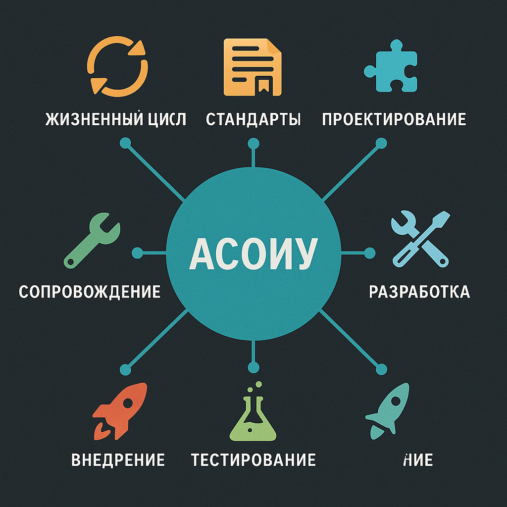

# 📚 Описание процессов жизненного цикла АСОИУ

## 🚀 Описание курса
Курс посвящён изучению процессов жизненного цикла автоматизированных систем обработки и управления информацией (АСОИУ).  
Студенты знакомятся с полным жизненным циклом информационных систем — от анализа требований до вывода из эксплуатации.  

Курс рассматривает:
- Стандарты и методологии создания информационных систем 📜
- Этапы жизненного цикла программных комплексов 🔄
- Подходы к управлению качеством и рисками 🛡️
- Документирование процессов разработки 📚
- Применение ГОСТ и международных стандартов ISO 📏

## 🏫 О кафедре
**Кафедра ИУ5**  
Факультет: "Информатика и системы управления"  
Университет: МГТУ им. Н. Э. Баумана

## 🛠️ Основные темы курса
- 📈 Анализ требований к АСОИУ
- 🧩 Проектирование архитектуры систем
- 🛠️ Разработка и интеграция компонентов
- 🧪 Тестирование и контроль качества
- 🛡️ Сопровождение и сопровождение
- 🗑️ Завершение жизненного цикла систем

## 🧠 Результаты обучения
После прохождения курса студенты смогут:
- Понимать полную структуру жизненного цикла информационных систем 📚
- Оценивать качество процессов разработки и внедрения систем 🛠️
- Применять стандарты ISO/ГОСТ на практике 🧩
- Разрабатывать документацию и сопровождать жизненный цикл проектов 📄
- Выбирать подходящие методологии для различных проектов (Waterfall, Agile и др.) 🚀

## ⚙️ Технологии и инструменты
## ⚙️ Технологии и инструменты

В рамках курса используются различные технологии и инструменты для моделирования и анализа автоматизированных систем управления:

- **SimPy** — библиотека на Python для дискретно-событийного моделирования процессов управления 🔄
- **Python** — язык программирования для создания алгоритмов и моделей 🐍
- **Matplotlib** — библиотека для визуализации данных и характеристик систем 📈
- **AnyLogic** — мощная среда для моделирования бизнес-процессов и сложных систем 🏢
- **GPSS Studio** — инструмент для имитационного моделирования систем на языке GPSS 🛠️
- **MASON** — многоагентная платформа для моделирования сложных систем 🧩
- **MATLAB** — среда для вычислений и моделирования инженерных задач 📊
- **SimSharp** — библиотека дискретно-событийного моделирования на C# ⚙️
- **SIMIO** — средство визуального моделирования бизнес- и производственных процессов 🏭
- **Repast** — фреймворк для агентного моделирования на Java и .NET 👥
- **Arena** — программное обеспечение для имитационного моделирования бизнес-процессов 📦
- **NetLogo** — среда для моделирования агентных систем и природных процессов 🐾
- **Engee** — инструмент для сетевого моделирования и анализа сетевых процессов 🌐
- **OMNet++** — платформа для моделирования коммуникационных сетей и распределённых систем 📡

## 📚 Рекомендуемая литература
- ГОСТ 34 серии (разработка и внедрение АС)
- Стандарты ISO/IEC по жизненному циклу ПО
- Документы по методологиям разработки (Waterfall, Agile и др.)

## 📎 Полезные ссылки
- 🔗 [Страница курса на e-learning BMSTU](https://e-learning.bmstu.ru/iu5/course/view.php?id=124)

---

> 📌 _Этот проект создан для систематизации знаний по предмету "Описание процессов жизненного цикла АСОИУ" в рамках обучения в МГТУ им. Н. Э. Баумана._

---

философ_5_.ipynb==Методические указания к семинару 8
taxi-sim-.ipynb==Методические указания к семинару 9 
sim-shop-.ipynb==Методические указания к семинару 10
repair-sim.ipynb==Методические указания к семинару 11